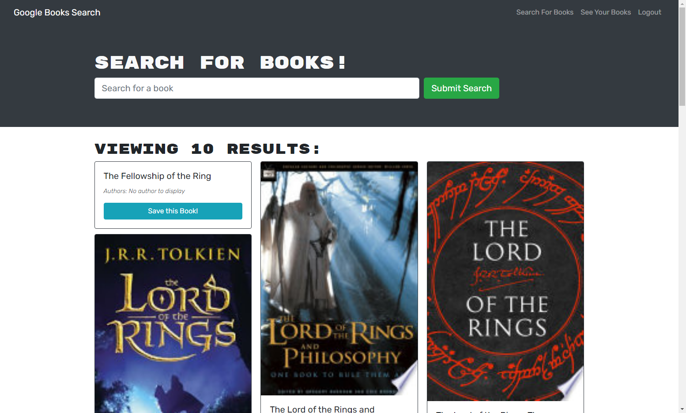

  # Book Search Engine

  ## Description
This project is a full stack application that utilizes MERN stack. This project is designed for users to search for any book using the Google Books API. The search will results in the title, author, and brief description of the book. You can also save your favorite books. This can be used to track how many books you've read throughout the years or even just to save your top books!

  ## Table of Contents
  * [Project Links](#links)
  * [Usage](#usage)
  * [Screenshots](#screenshots)
  * [Credits](#credits)
  * [License](#license)
  * [Contributing](#contributing)
  * [Tests](#tests)
  * [Questions](#questions)

  ## Links
  * [Deployed Application](https://arcane-thicket-99938.herokuapp.com/)
  * [GitHub Repo](https://github.com/jeaustins27/Book-Search-Engine)

  ## Usage
To get started, simply click the deployed application link above. It is recommended to sign up for an account before searching, this way you can save books to your profile. Once you have signed up you can begin searching. All books related to your search will appear below, add them to your collection simply by clicking the corresponding button.

  ## Screenshots
  

  ## Credits
  * [W3Schools](https://www.w3schools.com/)
  * [Readme.so](https://readme.so/)
  * [Stack Overflow](https://stackoverflow.com)
  * [React](https://react.dev/)
  * [MongoDB](https://www.mongodb.com/)
  * [GraphQL](https://graphql.org/)
  Starter code was provided by Rutgers Bootcamp

  
  ## License
  
  
  This project is licensed under the [MIT](https://choosealicense.com/licenses/mit/) license.

    

  ## Contributing
  You can help with contributing by reaching me via email.

  ## Tests
  There are no current tests to be ran.

  ## Questions
  If you have any questions you can reach out via [Email](mailto:JeaustinS27@gmail.com) or you can check out my GitHub profile at here: [GitHub](https://github.com/jeaustins27)
